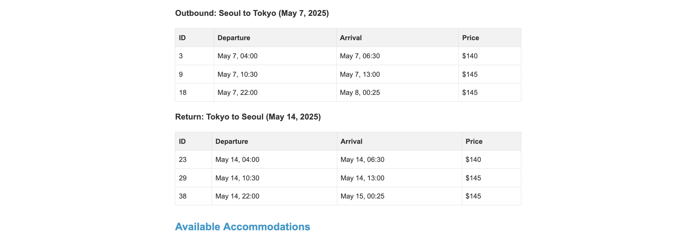

# bookingTripRequest-agency

This app represents an agency that searches for flights and accommodations via the
prompt from the user through a HTTP call. 

It's composed by a LLM (Anthropic) and tools to find flights, accommodations and sending mails. 

Once a search is requested the app will look for the flights, accommodations, 
and will email the requester with some options and the best value offer. 

## Prerequisites

Start a local email service. 
```shell
docker run -d -p 1025:1025 -p 8025:8025 mailhog/mailhog
```

To send emails after deploying this app in the Akka infrastructure, you need to set the env vars:
```shell
SMTP_HOST
SMTP_PORT
SMTP_AUTH
SMTP_START_TLS
```

More info in [EmailAPITool](src/main/java/com/lb/ai/tools/EmailAPITool.java);

> **Note**: Sending emails has only been tested when running in local.


## Call the service 

```shell
curl http://localhost:9000/trip/search \
-H "Content-Type: application/json" \
-d '{"question": "find a bookingTripRequest from seoul to tokyo and back, from 2025-05-07 to 2025-05-14 The flight price not higher than 300 total and the total accommodation for the week not higher than 600. Send the suggestion to 'test.user@gmail.com'"
}'
```
This will return an `uuid` that you can later use the check the state of the workflow.

## Book a trip

```shell
url http://localhost:9000/trip/book -d '{"flightRef":"12", "accommodationRef":"117"}' --header "Content-type: application/json"
```

## Check the state

```shell
curl http://localhost:9000/trip/workflow/[uuid-here]
```

```shell
curl http://localhost:9000/trip/flight/12
```

```shell
curl http://localhost:9000/trip/accommodation/117
```


The result (in `localhost:8025`) should be something like: 





Possible routes to extend the example: 
- improve prompt https://docs.spring.io/spring-ai/reference/api/prompt.html and include Patrik suggestions.
- Pre-reserve best value trip after request and send an email with that reservation to user 
- using timers to check if the flights/accommodations are still available in the market (fake must be then refactored to use a real/external endpoint)
- using views to check if flights already exist for the requested dates/constraints
